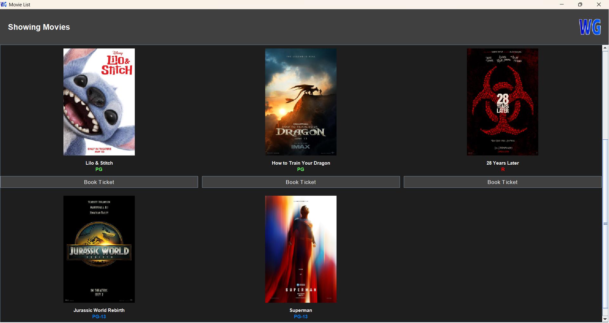

<h1 style="color:rgb(0, 140, 255);" align="center">WGCinema Software</h1>

### Introduction
This software was created by me and my friends as a university project for testing. WG stands for our group name "Wonderful Guys".

### Running the Program
There are two ways to run this program:
1. Open CMD in the software directory and run:
   ```cmd
   java -cp ".;mysql-connector-j-8.4.0.jar" Login
   ```
2. Double-click the `WGCinema.exe` file.

### Database
This software uses MySQL, preferably phpMyAdmin from XAMPP. You can find the queries in the `archives` folder for how to use the database and insert data.

<p align="center">
  
</p>

> This software is copyrighted by Joshi Minh. You can clone it to use in your hobby or school project as long as it is not used for profit.