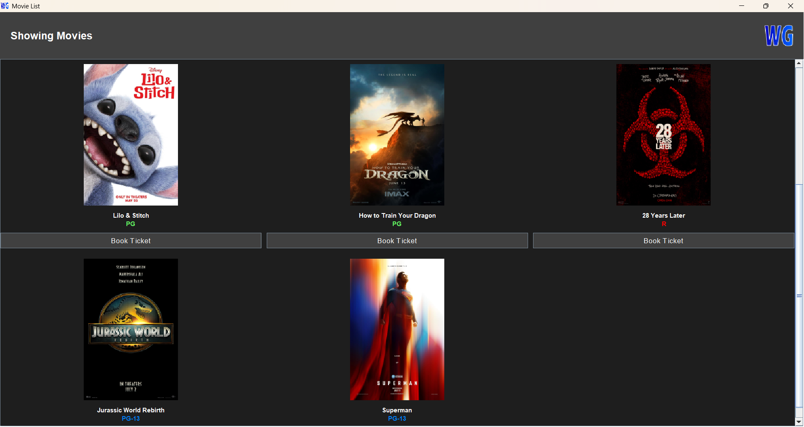

## Getting Started

Welcome to the VS Code Java world. Here is a guideline to help you get started to write Java code in Visual Studio Code.

## Folder Structure

The workspace contains two folders by default, where:

- `src`: the folder to maintain sources
- `lib`: the folder to maintain dependencies

Meanwhile, the compiled output files will be generated in the `bin` folder by default.

> If you want to customize the folder structure, open `.vscode/settings.json` and update the related settings there.

## Dependency Management

The `JAVA PROJECTS` view allows you to manage your dependencies. More details can be found [here](https://github.com/microsoft/vscode-java-dependency#manage-dependencies).


<h1 style="color:rgb(0, 140, 255);" align="center">WGCinema Software</h1>

### Introduction
This software was created as a university project by the "Wonderful Guys" group.

### Running the Program
There are two ways to run this program:
1. Open CMD in the software directory and run:
  ```cmd
  javac *.java
  java -cp ".;mysql-connector-j-8.4.0.jar" Login
  ```
2. Double-click the `WGCinema.exe` file.

### Database
This software uses MySQL, preferably phpMyAdmin from XAMPP. You can find the queries in the `sql` folder for database setup and data insertion.

<p align="center">
  
</p>

> This software is copyrighted. You can clone it for hobby or school projects as long as it is not used for profit.