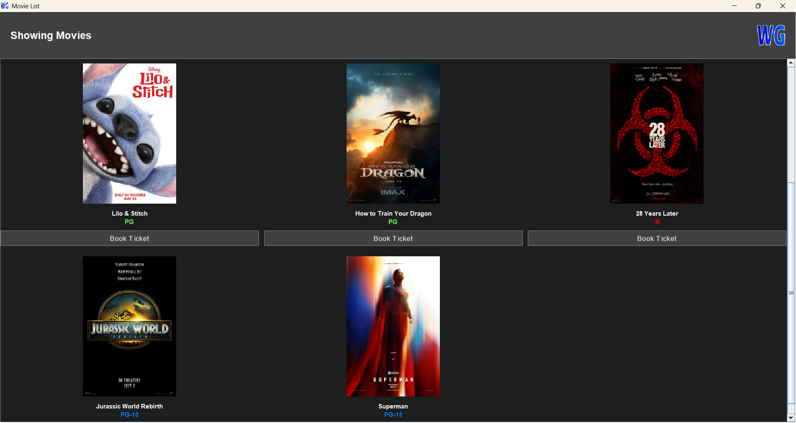

    

<h1 align="center">WGCinema Software</h1>

WGCinema Software is a university project developed collaboratively by our group, **"Wonderful Guys" (WG)**.

This repository features a **dual-architecture** setup. It contains two entirely distinct frontend applications that share the same underlying base and **MySQL** database.

## Architecture Structure

1. **Java Desktop Application (`/java-app`)**: 
   - A robust point-of-sale and dashboard application built with Java Swing and managed via **Gradle**. 
   - Ideal for staff and admins to manage showtimes, showrooms, check transaction histories, and book tickets locally.

2. **Web Application (`/website`)**:
   - A modern, highly-aesthetic, glassmorphism-themed customer-facing responsive website.
   - Built using HTML, Vanilla CSS, and modular JavaScript to allow customers to view currently showing and upcoming movies, check information, and log in.

## Getting Started

### Prerequisites
- **MySQL Database**: Execute `schema.sql` on your MySQL server to initialize the required tables (`movies`, `accounts`, `showrooms`, `showtimes`, `tickets`, `transactions`).
- **Java App**: Java JDK 24+ is required. Enter the `/java-app` directory and configure your database variables inside your `.env` file. Run the app using `./gradlew run`.
- **Website**: Simply open `/website/index.html` in any modern web browser. No compilation or Node server is required since it fetches internal JSON directly.

    

> This software is copyrighted. You are welcome to clone it for hobby or educational purposes, provided it is not used for profit.