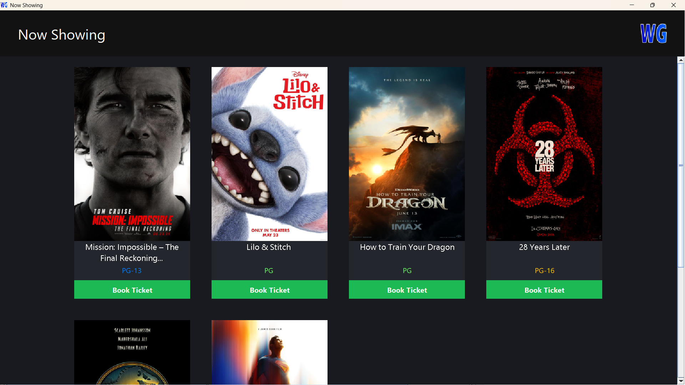
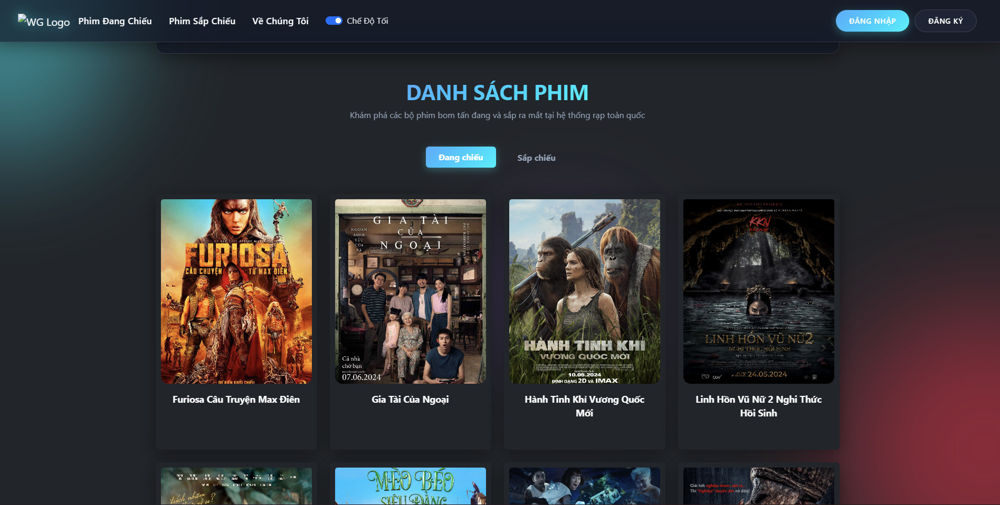

    
    <h1>WGCinema</h1>

WGCinema is a university project collaboratively developed by our group, **"Wonderful Guys" (WG)**.

This repository features a **dual-architecture** setup, containing two distinct applications that share a common codebase and a **MySQL** database.

## 1. Java Desktop Application (`/java-app`)

A robust point-of-sale and dashboard application built with Java Swing and managed via **Gradle**.

- Designed for staff and administrators to manage showtimes, showrooms, view transaction histories, and book tickets locally.
- **Requirements:** Java JDK 24+.
- **Setup:** Navigate to the `/java-app` directory, configure your database variables in the `.env` file, and run the app using `./gradlew run`.

    

## 2. Web Application (`/website`)

A modern, glassmorphism-themed, customer-facing responsive website.

- Features a completely redesigned interface with premium UI components, fluid animations, dynamic blur gradients, and unified authentication.
- Built using HTML, vanilla CSS, and modular JavaScript.
- Allows customers to view current and upcoming movies, access detailed information, and log in seamlessly.
- **Usage:** Open `/website/index.html` in any modern web browser. No compilation or Node server required.

    

---

> This software is copyrighted. You are welcome to clone it for hobby or educational purposes.