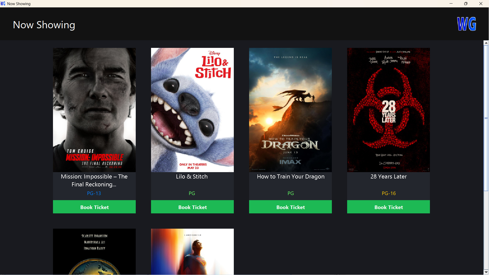

    

<h1 align="center">WGCinema Software</h1>

WGCinema Software is a university project developed collaboratively by our group, **"Wonderful Guys" (WG)**. This project leverages **MySQL** as the database and is built using **Gradle**. You can run the project using the command `gradle run` or build a JAR file with `gradle build`.

    

> This software is copyrighted. You are welcome to clone it for hobby or educational purposes, provided it is not used for profit.